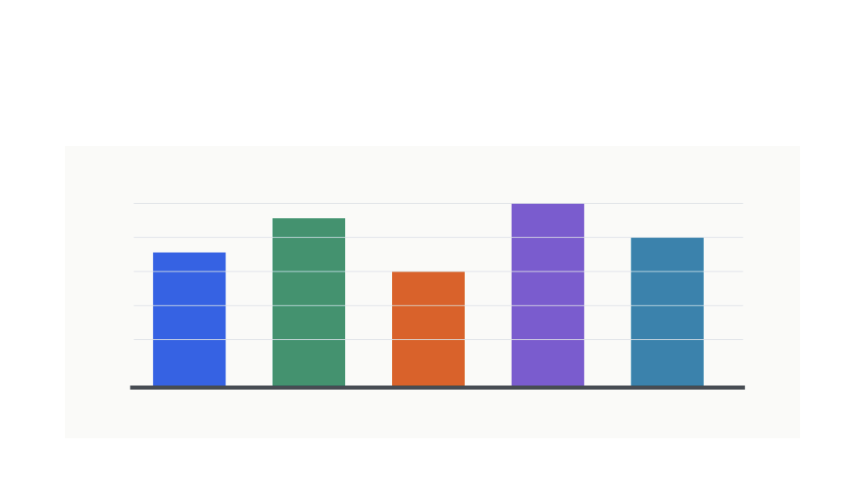

# Puppt

[](https://github.com/artpar/puppt/releases)
[](https://github.com/artpar/puppt/actions/workflows/ci.yml)
[](https://github.com/artpar/puppt/actions/workflows/release.yml)
[](https://pkg.go.dev/github.com/artpar/puppt)
[](https://goreportcard.com/report/github.com/artpar/puppt)

Puppt is a Go CLI for inspecting, editing, creating, validating, reviewing, and
rendering editable PowerPoint `.pptx` files.

It is built for agent and automation workflows where a deck must stay editable:
Puppt reads the PowerPoint Open XML package, plans mutations before writing,
rejects ambiguous or unsupported edits before mutation, and preserves unrelated
deck content wherever the package structure allows it.

## What You Can Do

- Inspect decks and return structured facts as JSON: slide order, titles,
  visible text, notes, media, layouts, masters, metadata, and unsupported
  content signals.
- Plan targeted edits without writing output, so agents and humans can review
  what will change before mutation.
- Edit supported content, including text, notes, metadata, slide order, slide
  add/delete/move/duplicate operations, image replacement, and simple editable
  shape additions.
- Create editable `.pptx` decks from structured input, including title slides,
  section slides, title/body slides, bullet lists, speaker notes, metadata, and
  provided images.
- Validate package structure and expected content after creation or edits.
- Review changes by combining prior command results, inspection facts, skipped
  items, unsupported items, and validation status.
- Render a slide to PNG through Puppt-owned Go code for visual review and
  diagnostics.

## Quick Start

Download release artifacts and checksums from
[GitHub Releases](https://github.com/artpar/puppt/releases).

Install from source:

```sh
go install github.com/artpar/puppt/cmd/puppt@latest
```

Build the local binary:

```sh
make build
```

## Usage Examples

Puppt works best as a tight loop: inspect the real `.pptx`, plan a targeted
change, write a new editable deck, review the result, and render the slides that
need a visual check.

The screenshots below are committed render outputs from the local renderer
corpus; use the same commands with any media-heavy `.pptx`.

### Inspect

Use `inspect` to turn a slide into stable JSON targets: text object IDs, text
runs, and media relationship targets.

<table>
  <tr>
    <th>Command</th>
    <th>Slide</th>
  </tr>
  <tr>
    <td>
      <pre><code class="language-sh">./bin/puppt inspect testdata/realworld-ppts/EPA-generate-2021-presentation.pptx --json |
  jq '{status, slide:(
    .inspection.slides[] |
    select(.number == 2) |
    {
      number,
      title,
      part,
      text_objects: [.visible_text[] | {object_id, runs}],
      image_refs: [.images[] | {object_id, relationship, target, content_type}]
    }
  )}'</code></pre>
      <pre><code class="language-json">{
  "status": "ok",
  "slide": {
    "number": 2,
    "title": "Energy 101: The big picture",
    "part": "ppt/slides/slide2.xml",
    "text_objects": [
      {
        "object_id": "ppt/slides/slide2.xml#shape-2",
        "runs": [
          "Energy 101: The big picture"
        ]
      },
      {
        "object_id": "ppt/slides/slide2.xml#shape-3",
        "runs": [
          "Primary energy resources",
          "Fossil:  coal, natural gas, petroleum",
          "Non-fossil, non-renewable:  uranium",
          "Renewable: wind, solar, hydro, geothermal, biomass",
          "Technologies to convert primary resources to ",
          "useable energy like electricity, gasoline, …",
          "Petroleum Refineries",
          "Electric Power Generation",
          "End-use sectors",
          "Residential",
          "Commercial",
          "Industrial ",
          "Transportation",
          "Energy services – ",
          "What do people actually need and want?  ",
          "Mobility",
          " (vehicle miles of travel) or ",
          "accessibility ",
          "(accessing education, work, shopping), ",
          "lighting",
          " (lumens of light), ",
          "comfort",
          " (space heating and cooling).  Energy is a “derived demand”"
        ]
      }
    ],
    "image_refs": [
      {
        "object_id": "ppt/slides/slide2.xml#rId8",
        "relationship": "rId8",
        "target": "ppt/media/image12.png",
        "content_type": "image/png"
      },
      {
        "object_id": "ppt/slides/slide2.xml#rId3",
        "relationship": "rId3",
        "target": "ppt/media/image7.jpeg",
        "content_type": "image/jpeg"
      },
      {
        "object_id": "ppt/slides/slide2.xml#rId7",
        "relationship": "rId7",
        "target": "ppt/media/image11.png",
        "content_type": "image/png"
      },
      {
        "object_id": "ppt/slides/slide2.xml#rId6",
        "relationship": "rId6",
        "target": "ppt/media/image10.png",
        "content_type": "image/png"
      },
      {
        "object_id": "ppt/slides/slide2.xml#rId11",
        "relationship": "rId11",
        "target": "ppt/media/image15.png",
        "content_type": "image/png"
      },
      {
        "object_id": "ppt/slides/slide2.xml#rId5",
        "relationship": "rId5",
        "target": "ppt/media/image9.png",
        "content_type": "image/png"
      },
      {
        "object_id": "ppt/slides/slide2.xml#rId10",
        "relationship": "rId10",
        "target": "ppt/media/image14.png",
        "content_type": "image/png"
      },
      {
        "object_id": "ppt/slides/slide2.xml#rId4",
        "relationship": "rId4",
        "target": "ppt/media/image8.jpeg",
        "content_type": "image/jpeg"
      },
      {
        "object_id": "ppt/slides/slide2.xml#rId9",
        "relationship": "rId9",
        "target": "ppt/media/image13.jpeg",
        "content_type": "image/jpeg"
      }
    ]
  }
}</code></pre>
    </td>
    <td></td>
  </tr>
</table>

### Render

Use `render` to produce PNGs from the `.pptx` itself. The JSON tells you which
slide part was painted and where the images were written.

<table>
  <tr>
    <th>Command</th>
    <th>Rendered PNGs</th>
  </tr>
  <tr>
    <td>
      <pre><code class="language-sh">./bin/puppt render \
  testdata/realworld-ppts/EPA-generate-2021-presentation.pptx \
  --slides 1-3 \
  --dpi 72 \
  --out 'docs/assets/readme/epa-generate-slide-{slide}.png' \
  --json |
  jq '{status, outputs, renders, unsupported_count:(.unsupported|length)}'</code></pre>
      <pre><code class="language-json">{
  "status": "ok",
  "outputs": [
    "docs/assets/readme/epa-generate-slide-1.png",
    "docs/assets/readme/epa-generate-slide-2.png",
    "docs/assets/readme/epa-generate-slide-3.png"
  ],
  "unsupported_count": 0
}</code></pre>
    </td>
    <td>
      <br>
      <br>
      
    </td>
  </tr>
</table>

### Edit

Use the object id from `inspect` to mutate one editable object without touching
unrelated slide content.

Save this as `.tmp/readme-edit-visual/replace-title.json`:

<table>
  <tr>
    <th>Command</th>
    <th>Before / After</th>
  </tr>
  <tr>
    <td>
      <pre><code class="language-json">{
  "operation": "replace_text",
  "target": {
    "type": "object_id",
    "object_id": "ppt/slides/slide2.xml#shape-2"
  },
  "replacement": "Energy 101: Edited with Puppt"
}</code></pre>
      <pre><code class="language-sh">./bin/puppt edit \
  testdata/realworld-ppts/EPA-generate-2021-presentation.pptx \
  --edit .tmp/readme-edit-visual/replace-title.json \
  --out .tmp/readme-edit-visual/epa-generate-edited.pptx \
  --json |
  jq '{status, summary, changes, validation}'</code></pre>
      <pre><code class="language-json">{
  "status": "ok",
  "summary": {
    "human": "Applied replace_text with 1 change(s)."
  },
  "validation": {
    "valid": true,
    "warnings": [],
    "errors": []
  }
}</code></pre>
    </td>
    <td>
      <strong>Before</strong><br>
      <br>
      <strong>After</strong><br>
      
    </td>
  </tr>
</table>

### Create And Review

Puppt can also create editable decks from JSON and then run review and rendering
on the generated `.pptx`. This example starts with `docs/examples/readme-create-deck.json`,
writes a new deck, reviews the creation changes, and renders the visual slide.

<table>
  <tr>
    <th>Command</th>
    <th>Created slide</th>
  </tr>
  <tr>
    <td>
      <pre><code class="language-sh">mkdir -p .tmp/readme-create-review

./bin/puppt create \
  --input docs/examples/readme-create-deck.json \
  --out .tmp/readme-create-review/market-expansion-review.pptx \
  --json > .tmp/readme-create-review/create-result.json

./bin/puppt review \
  .tmp/readme-create-review/market-expansion-review.pptx \
  --changes .tmp/readme-create-review/create-result.json \
  --json |
  jq '{status, summary, changes, validation}'

./bin/puppt render \
  .tmp/readme-create-review/market-expansion-review.pptx \
  --slide 3 \
  --out .tmp/readme-create-review/created-slide-3.png \
  --json |
  jq '{status, summary, render, unsupported: (.unsupported | length)}'</code></pre>
      <pre><code class="language-json">{
  "status": "ok",
  "summary": {
    "human": "Reviewed 3 slide deck with 3 reported change(s) on slide 1, slide 2, slide 3; skipped 0, ambiguous 0, unsupported 0; validation passed."
  },
  "changes": [
    {
      "slide_number": 1,
      "object_id": "ppt/slides/slide1.xml",
      "message": "Created slide 1 from title."
    },
    {
      "slide_number": 2,
      "object_id": "ppt/slides/slide2.xml",
      "message": "Created slide 2 from section."
    },
    {
      "slide_number": 3,
      "object_id": "ppt/slides/slide3.xml",
      "message": "Created slide 3 from title_body."
    }
  ],
  "validation": {
    "valid": true,
    "warnings": [],
    "errors": []
  }
}
{
  "status": "partial",
  "summary": {
    "human": "Rendered slide 3 with 2 unsupported object(s)."
  },
  "render": {
    "slide_number": 3,
    "slide_part": "ppt/slides/slide3.xml",
    "width": 960,
    "height": 540
  },
  "unsupported": 2
}</code></pre>
    </td>
    <td>
      <strong>Rendered from the created deck</strong><br>
      
    </td>
  </tr>
</table>

## Commands

| Command | Use |
| --- | --- |
| `inspect` | Read a `.pptx` deck and return structured facts. |
| `plan` | Resolve targets and validate an edit request without writing output. |
| `edit` | Apply supported targeted edits and write a new `.pptx`. |
| `create` | Create an editable `.pptx` deck from structured input. |
| `validate` | Check package structure and expected content. |
| `review` | Summarize deck changes for agents and human reviewers. |
| `render` | Render one slide to a PNG image. |
| `version` | Print Puppt version information. |

Run command help for exact flags:

```sh
puppt --help
puppt <command> --help
```

During development, use:

```sh
go run ./cmd/puppt --help
```

## Editing Model

Puppt treats `.pptx` files as structured Open XML packages, not as screenshots.
The normal edit flow is:

1. Inspect the deck to find stable targets.
2. Plan the edit and check whether the target is ready, ambiguous, missing, or
   unsupported.
3. Apply the edit only when the plan is supported.
4. Validate the written deck.
5. Review the result as JSON for downstream agents or human reviewers.

Ambiguous targets and unsupported advanced visual edits are rejected before the
deck is mutated. Supported edits are written through Puppt-owned package
handling so unrelated parts of the deck stay intact.

## Rendering

`puppt render` is a Puppt-owned Go renderer. It does not shell out to
LibreOffice, PowerPoint, Keynote, browser renderers, SaaS renderers, or
image-conversion tools.

The renderer currently covers practical static PPTX content including slide
dimensions, backgrounds, themes, layouts and masters, placeholders, pictures,
common image metadata, shape fills and outlines, connectors, text, bullets,
tables, selected shadows/effects, simple diagram fallback drawings, and explicit
JSON reports for content that is not painted or only partially painted.

Renderer parity is still in progress. Puppt is useful for visual review and
diagnostics today, but final renderer conformance is not claimed yet. See
`docs/RENDERING.md`, `docs/RENDERER_COMPLETION_GOAL.md`, and
`docs/RENDERER_COMPLETION_CHECKLIST.md` for the current renderer status and
completion path.

## Current State

Puppt has fixture-backed v1 workflows for inspection, edit planning, supported
mutations, image replacement, simple editable additions, structured deck
creation, validation, review, and rendering. Full production-grade compliance is
not claimed yet.

All required v1 command names are implemented: `inspect`, `plan`, `edit`,
`create`, `validate`, `review`, `render`, and `version`.

## Development

Run the baseline test suite:

```sh
go test ./...
```

Build the local binary:

```sh
make build
```

Run the repository verification handoff:

```sh
make verify
```

## Docs

User workflows:

- [Commands](docs/COMMANDS.md)
- [Create examples](docs/CREATE_EXAMPLES.md)
- [Plan examples](docs/PLAN_EXAMPLES.md)
- [Failure modes](docs/FAILURE_MODES.md)
- [Acceptance workflow](docs/ACCEPTANCE.md)

Capability and status:

- [Status](docs/STATUS.md)
- [Support matrix](docs/SUPPORT_MATRIX.md)
- [Rendering](docs/RENDERING.md)

Engineering and completion:

- [Renderer completion goal](docs/RENDERER_COMPLETION_GOAL.md)
- [Renderer milestones](docs/renderer-milestones/00-INDEX.md)
- [Build and release](docs/BUILD_RELEASE.md)
- [Technical KT](docs/TECHNICAL_KT.md)

## Implementation Language

The product core, CLI, public API surface, tests, and fixtures are implemented
in Go.
