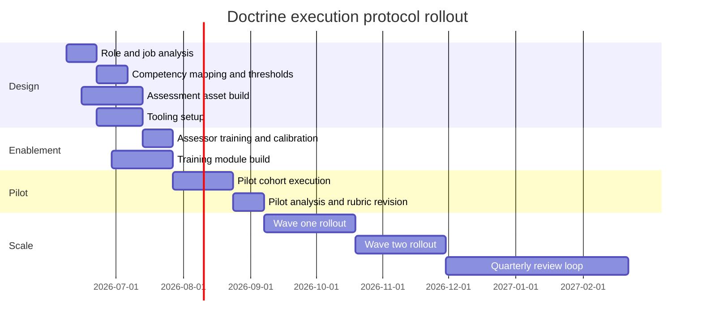

# GitHub Gist Doctrine Execution Protocol

## Executive summary

The source gist is not a lightweight coding guide. It is a full software-engineering doctrine for systems expected to endure for years, survive hostile production conditions, scale materially, and remain operable through team turnover. It explicitly prioritizes correctness, reliability, maintainability, debuggability, predictability, operability, recoverability, and long-term evolution over novelty, fashion, or short-term velocity. It also defines a normative accountability structure for every rule: what must be done, why the rule exists, what failure mode it prevents, what it costs, what exceptions exist, and how compliance is verified, detected, and corrected. That structure is exactly what makes the gist operationalizable into a people-and-process execution protocol. citeturn0view0turn1view0

The most important translation step is to turn doctrine into **competencies with evidence**. In practice, that means every source rule becomes four things at once: a skill expectation, a measurable behavior, an observable artifact, and a gating criterion. The protocol below therefore converts the gist into eleven assessable competency domains, a four-level proficiency model, a multi-hurdle assessment architecture, a training-and-remediation loop, and a governance model for rollout and continuous improvement. The design also respects the gist’s own calibration logic: rigor increases with criticality and scale, and C2+ systems require a stronger baseline than experimental or low-impact work. citeturn0view0turn8view0

For hiring and internal capability assessment, the strongest operational pattern is a **job-analysis-driven, multi-method, multi-hurdle** system: structured interviews for judgment and behavioral evidence, work-sample exercises for authentic engineering performance, and standardized rubrics for comparability and fairness. OPM guidance emphasizes that structured interviews should ask the same questions in the same order and score answers against the same scale; work samples should mirror actual job tasks; and HHS guidance recommends reliability, validity, legal defensibility, and applicant reactions as explicit design considerations, while also recommending tracking manager satisfaction, applicant satisfaction, time to hire, and the observed effectiveness of the assessment tools themselves. citeturn14view0turn14view1turn22view0turn17view0turn21view0

For proficiency architecture, the cleanest approach is to use the gist as the substantive standard, SWEBOK as the breadth-of-discipline reference, and SFIA as the progression model. SWEBOK v4 is a consensus-driven IEEE software-engineering knowledge baseline with eighteen knowledge areas, and the SWEBOK–SFIA mapping explicitly positions software-engineering competencies against levels of responsibility. SFIA’s responsibility model is useful here because it lets the same doctrine scale from junior engineers who follow guardrails to senior engineers who design operating models and approve risk-bound exceptions. citeturn14view6turn18view0turn14view2

A practical rollout should proceed in two stages. First, a twelve-week pilot creates the role profiles, rubrics, question bank, code/design/incident exercises, interviewer training, and dashboards. Second, phased expansion embeds the protocol into hiring, onboarding, internal progression, architecture review, and operational readiness review. Training effectiveness should be measured at the levels of reaction, learning, behavior, and results, while software-outcome impact should be tracked with DORA-style delivery metrics, SLO/error-budget governance, and doctrine compliance metrics such as telemetry coverage, restore-test success, exception expiry, documentation freshness, and unsupported interface versions. citeturn14view8turn15view0turn19view0turn19view1turn8view0

| Protocol element | Recommendation | Why it matters |
|---|---|---|
| Competency model | Use eleven doctrine-derived domains covering governance, architecture, code, testing, operations, security, performance, and lifecycle | The gist covers the full software lifecycle, not only implementation |
| Proficiency model | Use four levels: Novice, Practitioner, Advanced, Expert | This is simple enough for operations while preserving SFIA-style responsibility growth |
| Assessment architecture | Use six hurdles: knowledge screen, code review/refactor, design exercise, incident simulation, structured interview, evidence review | Structured interviews and work samples together provide stronger behavioral evidence than conversation alone |
| Scoring model | Use a 1–5 rubric per competency, equal weighting by default, role-calibrated pass thresholds, and hard red-flag fails for doctrinal non-negotiables | This preserves fairness while reflecting the source doctrine’s mandatory controls |
| Training model | Teach doctrine through labs, artifacts, and operational simulations, then validate transfer on the job | The doctrine emphasizes operability, not classroom-only knowledge |
| Governance model | Use quarterly review of incidents, exceptions, stale docs, assessment quality, and outcome metrics | The source explicitly warns against ceremonial review, reliability theater, and permanent exceptions |

## Source-derived competency framework

The table below collapses the gist’s thirty-six sections into eleven assessable domains without losing source coverage. The grouping is meant to make the doctrine operable for hiring, progression, onboarding, and capability review, while remaining broad enough to align to SWEBOK’s knowledge-area structure and SFIA’s responsibility model. citeturn18view0turn14view6turn14view2

| Competency domain | Source coverage | Extracted sub-competencies | Source examples and notes |
|---|---|---|---|
| Governance, terminology, and engineering judgment | Sections 0, 1, 3, 7, 35, 36. citeturn0view0turn1view0turn8view0 | Normative language; ownership semantics; rule accountability format; key system terms; core axioms; engineering values; ethics; final operating principle; ability to explain why a rule exists, what it prevents, and how it is enforced. | The gist treats software as a socio-technical system, assumes production is adversarial, and requires unenforceable rules to be rewritten or removed. A critical invariant example is that each payment capture should map to one authorized payment intent. |
| Risk classification and tradeoff management | Sections 2, 5, 6. citeturn0view0turn1view0 | Criticality and scale classification; control escalation; tradeoff hierarchy; conflict resolution; architecture decision records; new capability decision tree; dependency-approval decision tree; release go/no-go logic. | The source explicitly says systems cannot be downgraded in classification to avoid controls, and that data integrity outranks availability when the two conflict. |
| Ownership, exceptions, and organizational resilience | Sections 4, 9, 10, 22, 34. citeturn0view0turn1view0turn8view0 | Component ownership; exception and waiver management; entropy budgeting; organizational decay detection; quarterly leadership review; on-call doctrine; bus-factor reduction; stewardship rules; enforcement levels from documentation through independent assurance. | Non-negotiables include ownership, review/traceability, telemetry, recovery strategy for critical state, dependency approval, migration paths, secret handling, bounded retries, rollback capability, and operational documentation. |
| Architecture, boundaries, and system decomposition | Sections 11, 12, 30, 31.1, 33.3. citeturn2view0turn8view0 | Coupling and cohesion; module boundaries; failure domains; dependency direction; eventing rules; concurrency model declaration; modular-monolith default; evidence-based service extraction; API evolution; schema evolution; service boundary criteria; architecture review readiness; scalability order of operations. | The gist prefers modular monoliths first and requires evidence before introducing microservices. It distinguishes fact events from disguised commands, illustrated by the good event `InvoicePaid` and the bad event `SendInvoiceEmailNow`. |
| Data, state, APIs, compatibility, and concurrency | Sections 24, 25, 26, 27, 28. citeturn7view0turn8view0 | API request/response design; stable machine-readable errors; data ownership; data classification; retention/deletion; repairability; source-of-truth discipline; state machines; configuration as controlled state; race-condition controls; optimistic concurrency; distributed locking safety; compatibility matrices and compatibility testing. | The source gives a payment-state-machine example and an API error example using a stable error code, retryability flag, and correlation ID. It also requires compatibility tests for old-client/new-server and migration/rollback combinations. |
| Code construction and maintainability | Section 13 and anti-pattern cross-links. citeturn3view0turn8view0 | Readability; semantic naming; repository/file placement; function/class/module sizing; abstraction discipline; inheritance vs composition; side-effect classification; immutability; explicit error typing; structured logging; serialization rigor; nullability handling; defensive programming. | The gist includes good/bad naming examples such as `amountCents` over `amount`, and a good payment-error-handling example that preserves causal context and classifies retryable vs non-retryable failures. |
| Testing, verification, and code review | Sections 14, 20.2–20.3, 31.2–31.3, 33.5. citeturn4view0turn6view0turn8view0 | Test ownership; unit/integration/contract/property/E2E/reliability/chaos/fuzz/mutation/performance testing; coverage floors; flaky-test handling; deterministic CI; forbidden testing practices; review criteria for correctness, invariants, security, compatibility, tests, performance, operational impact, and documentation. | The source’s testing example is a serialize/deserialize property. It explicitly forbids deleting failing tests to pass CI and says reviewers must not approve code they do not understand. |
| Observability, debugging, and incident response | Sections 8, 15, 20.9–20.10, 31.3, 33.6–33.7. citeturn1view0turn4view0turn6view0turn8view0 | Failure assumptions; failure-mode registers; mandatory telemetry; log/metric/trace design; reproducible bug reporting; replay capability where needed; production-debugging discipline; incident severity handling; incident roles; postmortem quality; avoidance of observability theater and reliability theater. | The source provides a failure-mode register with examples such as payment-provider timeouts, cache stampedes, and schema-migration locks, each with signals, mitigations, and permanent fixes. |
| Reliability, release, deployment, and recovery | Sections 16, 20.4–20.8, 29, 32. citeturn4view0turn5view0turn6view0turn8view0 | SLIs/SLOs/error budgets; timeout discipline; retry safety; circuit breakers; idempotency; transaction handling; rollback vs roll-forward; recovery procedures; DR and corruption handling; graceful degradation; release artifacts; feature-flag governance; staging/canary logic; deployment gates; emergency deployment controls. | The source includes an SLO example for checkout authorization, explicit timeout defaults by call type, rollback/roll-forward decision rules, and required deployment blocks when critical tests fail or rollback is absent. |
| Security, dependencies, and software supply chain | Sections 17, 19, 33.1, 33.10, 33.11. citeturn5view0turn6view0turn8view0 | Trust boundaries; authentication and authorization; secret handling; cryptography policies; dependency trust review; vulnerability and upgrade cadence; SBOM/provenance; build reproducibility; sandboxing; exploit mitigations; auditability; secure defaults; anti-cargo-cult dependency decisions. | The source forbids secrets in code or logs, shared writable databases across services, dependency introduction without approval, and production deployment from developer machines. |
| Performance, documentation, and lifecycle evolution | Sections 18, 21, 23. citeturn5view0turn6view0turn7view0 | Latency/throughput/memory/storage budgeting; caching/batching/async design; lock contention measurement; benchmark ownership; required component docs; runbooks; onboarding docs; change history; refactoring discipline; dead-code removal; technical-debt accounting; deprecation windows; migration strategies; rewrite criteria; lifecycle statuses; aging prevention. | The source includes a latency-budget table, a runbook doctrine, a good-comment example about preserving historical billing logic, default deprecation windows, and an explicit rule that rewrites are not justified by boredom or fashion. |

Two cross-cutting overlays should apply to every domain. First, **criticality and scale calibrate rigor**: what is acceptable for a low-impact internal utility is not acceptable for a customer-facing payments system. Second, **non-negotiables create hard gates**, not merely preferences: ownership, traceability, telemetry, recovery, secret handling, safe retries, migration paths, rollback/roll-forward planning, and operational documentation are gating controls. citeturn0view0turn1view0

## Proficiency model and observable behaviors

SFIA defines seven responsibility levels and explicitly positions them as a foundation for mapping competencies and career progression. For operational use, four levels are usually sufficient and easier to calibrate in interviewing, internal assessment, and promotion discussions. The four levels below are therefore a practical condensation of SFIA’s progression model, mapped onto the gist’s expectations for ownership, operational readiness, and judgment. citeturn14view2

| Level | Practical label | Typical role bands | What this looks like in practice |
|---|---|---|---|
| 1 | Novice | entry-level, new-to-domain | Follows existing standards and checklists; identifies obvious issues; needs guidance to make tradeoffs; contributes within a bounded component |
| 2 | Practitioner | solid junior to mid-level | Independently delivers within known patterns; writes tests/docs; uses standard reliability and security controls correctly; escalates uncertainty |
| 3 | Advanced | senior engineer | Owns components or services; designs for failure; handles migrations, incidents, and compatibility tradeoffs; improves team practices |
| 4 | Expert | staff/principal/engineering lead | Defines policy, reviews exceptions, drives org-level quality and reliability programs, mentors assessors, and improves the system around the code |

The next table maps each doctrine-derived competency to measurable behaviors, observable indicators, and target proficiency by role band. The numbers refer to the four-level scale above.

| Competency domain | Measurable behaviors | Observable indicators | Junior | Mid | Senior | Staff+ |
|---|---|---|---:|---:|---:|---:|
| Governance, terminology, and judgment | Correctly interprets rules; explains tradeoffs; uses accountability format; names system boundaries and invariants | ADRs with owner/date/alternatives/rollback; accurate classification of defects/incidents/interfaces/state | 1–2 | 2 | 3 | 4 |
| Risk classification and tradeoffs | Classifies systems by impact/scale; chooses controls accordingly; defends decisions with explicit tradeoffs | Correct C/S class tagging; de-risked decision records; escalation when integrity/security outrank speed | 1 | 2 | 3 | 4 |
| Ownership and organizational resilience | Accepts lifecycle ownership; identifies entropy and exceptions; contributes to runbooks/on-call readiness | Ownership registry accuracy; exception records with expiry; toil reduction; cross-training evidence | 2 | 2 | 3 | 4 |
| Architecture and boundaries | Defines clear boundaries, failure domains, and service/module choices; resists premature distribution | Context/component diagrams; explicit state ownership; migration-friendly interfaces; justified service extraction | 1 | 2 | 3 | 4 |
| Data/state/API/compatibility/concurrency | Designs safe APIs and schema evolution; enforces source of truth; handles concurrent failure modes | Expand-migrate-contract plans; compatibility matrices; idempotency/concurrency controls; repairability evidence | 1 | 2 | 3 | 4 |
| Code construction and maintainability | Writes readable, explicit, testable code with typed errors and controlled side effects | Small comprehensible functions; semantic naming; explicit error taxonomy; structured logs; stable serialization | 2 | 3 | 3 | 4 |
| Testing and verification | Chooses the right test type; protects invariants; treats flakiness as a defect; uses CI as a quality gate | Test plans covering edge/failure cases; contract and migration tests; flaky-test repairs; meaningful coverage | 2 | 3 | 3 | 4 |
| Observability and incident response | Makes systems explainable; correlates logs/metrics/traces; triages incidents methodically | Dashboards with request/error/latency/version; failure-mode registers; reproducible bug reports; postmortem actions | 1–2 | 2 | 3 | 4 |
| Reliability, release, deployment, and recovery | Uses SLOs, timeouts, retries, rollback, and DR planning as design inputs | SLO documents; safe retry policies; rollback/roll-forward plans; restore-drill evidence; staged deploy artifacts | 1 | 2 | 3 | 4 |
| Security and supply chain | Identifies trust boundaries; handles secrets correctly; reviews dependencies and build integrity | Threat-model notes; least-privilege decisions; dependency approvals; SBOM/provenance; safe defaults | 1–2 | 2 | 3 | 4 |
| Performance, documentation, and lifecycle evolution | Works from budgets and measurements; writes operational docs; plans deprecation and migration | Latency budgets; benchmark baselines; runbooks; change histories; debt register; deprecation schedules | 1 | 2 | 3 | 4 |

Role calibration should not be title-only. A mid-level engineer owning a C3 user-facing service may need a higher target in reliability, security, incident response, and recovery than a nominally more senior engineer working on low-impact internal automation. That follows directly from the source doctrine’s control-escalation logic. citeturn0view0

The protocol should also define **red-flag fail conditions**. These are not “low scores.” They are doctrine violations serious enough to trigger an automatic fail or mandatory remediation, because the gist treats them as forbidden or merge/release/operation blockers.

| Red-flag condition | Reason for automatic fail or mandatory remediation |
|---|---|
| No owner for a production component | The source treats unowned production software as unacceptable |
| Willingness to bypass review/traceability outside the defined emergency path | The doctrine requires attributable and reversible changes |
| Accepting a service without telemetry | The source says operations require evidence, not blind confidence |
| Accepting critical state without backup/restore/corruption strategy | This is an existential reliability failure in the doctrine |
| Releasing a breaking interface change without migration path | Consumer safety and compatibility are mandatory |
| Storing or logging secrets | The doctrine treats exposed secrets as a compromise path |
| Designing infinite timeouts, infinite retries, or unsafe retries | The source explicitly forbids these patterns |
| Proposing manual production data mutation without approved repair procedure | The doctrine forbids ad hoc production mutation |
| Releasing from a developer machine or without reproducible artifacts | The source requires controlled build and deployment provenance |

These red flags are not arbitrary. They correspond directly to the gist’s non-negotiables and forbidden practices. citeturn0view0turn1view0turn5view0turn6view0turn8view0

## Assessment system and scoring rubrics

The recommended assessment strategy is a **multi-hurdle system** built from job analysis, structured interviews, work samples, and standardized scoring. OPM guidance stresses that structured interviews should use the same predetermined questions, in the same order, with the same rating standards; its broader structured-interview guidance also notes that higher structure improves validity, rater reliability, and agreement. OPM’s work-sample guidance recommends tasks that mirror the job itself, and HHS guidance explicitly recommends multi-hurdle assessment strategies, pre-defined passing grades, reliability/validity review, and ongoing tracking of assessment effectiveness. OPM scoring guidance further recommends equal weighting by default unless there is a clear documented rationale to weight differently. citeturn14view0turn22view0turn14view1turn17view0turn21view0

### Assessment blueprint

| Hurdle | Method | Domains emphasized | Recommended duration | Assessor effort | Pass rule |
|---|---|---|---:|---:|---|
| Foundation screen | Timed knowledge test with scenario-based MCQs and short answers | governance, classification, non-negotiables, terminology, security/reliability fundamentals | 30–40 min | 15–20 min review | Junior 70%, Mid 75%, Senior 80%, Staff+ 85%; zero tolerance for red-flag answers |
| Code review and refactor exercise | Realistic defect-finding and refactoring task in a sandbox repo | code quality, testing, logging, secrets, retries, maintainability, review judgment | 60 min | 30–40 min scoring | Weighted score meets role threshold; no red-flag fail |
| System design exercise | Written/walkthrough design scenario with operational constraints | architecture, state, APIs, compatibility, recovery, security, scalability | 45 min junior-mid; 60 min senior+ | 30–45 min scoring | Junior optional/lightweight; Mid 75/100; Senior+ 80/100 |
| Incident/debugging simulation | Triage live or tabletop simulation using logs/metrics/deploy timeline | observability, incident response, SLO/error budget reasoning, rollback decisioning | 45–60 min | 30–45 min scoring | Mid 70/100; Senior+ 80/100 |
| Structured interview | Standardized behavioral and situational interview | ownership, judgment, decisions under uncertainty, documentation, collaboration, ethics | 50–60 min | 30 min per interviewer | Mean score meets role target and panel spread ≤1 point on materially weighted competencies |
| Evidence review | Optional portfolio review for senior/staff roles | ADRs, runbooks, postmortems, migration plans, design docs, quality improvements | 20–30 min | 20–30 min | Required for Senior+/managerial roles; used to confirm level-3/4 claims |

A reference candidate journey should stay within the HHS benchmark that an individual assessment tool should not exceed about one hour. In practice, that yields a total candidate-facing load of roughly 2.5 to 4.5 hours, depending on role seniority and whether the portfolio/design evidence review is required. citeturn17view0

### Scoring model

Use a 1–5 rubric for each scored competency in each hurdle.

| Score | Rubric meaning | Behavioral anchor |
|---:|---|---|
| 1 | Harmful or unsafe | Misses core risk, violates doctrine, or recommends an explicitly forbidden practice |
| 2 | Weak | Sees part of the issue but misses important controls, edge cases, or operational consequences |
| 3 | Competent | Meets the doctrine baseline for the role; answer would be safe to implement with normal review |
| 4 | Strong | Anticipates edge cases, explains tradeoffs, and includes supporting controls and evidence |
| 5 | Exemplary | Shows system-level judgment, operational realism, and improvement-oriented thinking beyond the immediate task |

Use equal weights across competencies unless the role profile documents a stronger weight for particular domains. OPM recommends equal weights unless there is a clear and documented reason not to do so; that is a good default here as well. citeturn21view0

### Role-based pass thresholds

| Role band | Minimum overall score | Minimum score in critical domains | Additional gate |
|---|---:|---:|---|
| Junior | 70/100 | 60/100 in code, testing, security, ownership | No red-flag fail |
| Mid | 75/100 | 65/100 in code, testing, reliability, security | No red-flag fail; at least one practical exercise at 3/5 average |
| Senior | 80/100 | 70/100 in architecture, reliability, incident response, security | No red-flag fail; design and incident simulation each at least 3.5/5 |
| Staff+ | 85/100 | 75/100 in governance, architecture, reliability, organizational stewardship | No red-flag fail; evidence of level-4 impact in at least two domains |

### Sample assessment items

The following sample artifacts are intentionally doctrine-centric. They test whether the candidate can **operate the doctrine**, not merely repeat slogans from it. The themes come directly from the source’s non-negotiables, decision trees, anti-patterns, and examples. citeturn0view0turn1view0turn2view0turn3view0turn4view0turn8view0

#### Knowledge questions

| Question | What a passing answer should show |
|---|---|
| What is the difference between a release and a deployment, and why must they be tracked separately? | Distinguishes eligibility-for-production from movement-into-environment and explains rollback/audit implications |
| When is a breaking interface change acceptable? | Only with migration path by default; emergency only for exceptional security/legal cases with incident-level communication |
| Why does the doctrine prefer a modular monolith before microservices? | Operational simplicity, lower hidden complexity, fewer failure modes, service extraction only when justified |
| What makes a retry safe? | Bounded attempts, delay/backoff/jitter, idempotency or transaction safety, retryable error classification, total timeout budget |
| What should be included in a decision record? | Owner, context, alternatives, decision, failure modes, impacts, rollback/exit, review date, and related evidence |

#### Structured interview questions

Ask these questions exactly as written for all candidates at the same role level, in the same order, using the same scoring anchors and probe list. That is consistent with OPM’s structured-interview guidance. citeturn14view0turn22view0

| Question | What strong evidence looks like |
|---|---|
| Tell me about a time you chose correctness or data integrity over delivery speed or availability. What tradeoff did you make and how did you communicate it? | Explicit hierarchy of values, bounded impact, owner approval, compensating controls, follow-up verification |
| Describe a production issue where missing telemetry hurt diagnosis. What did you add afterward? | Specific missing signals, faster diagnosis after remediation, dashboard/alert ownership, evidence mindset |
| Tell me about a dependency you rejected, isolated, or removed. What lifecycle risks drove the decision? | Maintenance/security/license/provenance/lock-in analysis, adapter strategy, replacement plan |
| Walk through a schema or API migration you executed without breaking consumers. | Expand-migrate-contract thinking, consumer compatibility, deprecation windows, rollback/roll-forward planning |
| Describe a postmortem that changed engineering behavior instead of becoming theater. | Concrete actions, owners, due dates, tooling/process changes, measurable follow-through |

#### System design prompt

**Prompt**

> Design an invoice-ingestion and approval service for a C2/S2 business-critical SaaS product. The service accepts uploaded invoice files, stores metadata, calls an OCR provider, emits events to downstream systems, and exposes an external API for status.  
>  
> Your design must specify: owner, state ownership, trust boundaries, SLI/SLO, timeout and retry policy, idempotency strategy, schema-evolution plan, event versioning, telemetry, deployment/rollback plan, dependency-isolation strategy, and one likely failure-mode register entry.

**Scoring dimensions**

- boundary clarity and ownership
- durable-state strategy
- compatibility and migration safety
- observability completeness
- failure isolation and retry safety
- security boundaries and secret handling
- release and recovery realism

#### Incident simulation prompt

**Prompt**

> You are on call for a payment-capture workflow. Over the last 20 minutes, dependency latency has increased, retries have spiked 8x, queue depth is rising, and the service has consumed 18% of its four-week error budget in two hours. A deployment happened 25 minutes ago.  
>  
> State your first five actions. Then explain whether you would roll back, roll forward, or freeze releases; what evidence you would preserve; what user impact you would communicate; and what the postmortem must change.

**Scoring dimensions**

- triage sequence
- stop-the-bleed logic
- rollback vs roll-forward judgment
- evidence preservation
- communication quality
- doctrine-aligned corrective action

#### Code exercise

```python
API_KEY = "live-prod-secret"

def process_payment(user_id, amount):
    while True:
        try:
            print(f"charging user={user_id} key={API_KEY}")
            result = payment_provider.charge(user_id, amount)
            db.execute(f"UPDATE invoices SET status='paid' WHERE user_id='{user_id}'")
            return True
        except Exception:
            pass
```

**Candidate task**

Refactor this into production-acceptable code according to the doctrine. You should:

- identify the defects and doctrinal violations
- redesign the function boundary
- add timeout, retry, idempotency, and explicit error handling
- remove secret exposure
- make database mutation safe and auditable
- add structured logging and telemetry
- outline the minimum unit and integration tests you would write

**What the reviewer scores**

- recognizes infinite retry, silent error swallowing, secret leakage, direct unsafe SQL, no timeout, non-idempotent mutation, absent observability, and lack of typed errors
- separates orchestration from side effects
- classifies retryable vs non-retryable failure
- proposes tests for timeout, duplicate execution, dependency decline, and partial failure
- preserves ambiguity when payment outcome is uncertain, rather than inventing success or failure

### Interviewer calibration rules

Before any live use, assessors should complete a calibration session using one recorded mock interview, one design response, and one code-review sample. OPM’s guidance emphasizes interviewer training, rating consistency, and the value of structured questions tied to competencies identified through job analysis; HHS guidance recommends consensus processes and flags score differences greater than one point on a five-point scale as a reason for discussion. citeturn22view0turn17view0turn16search9

## Training and operational implementation

The training program should teach the doctrine **from outcomes backward**. Kirkpatrick’s model recommends starting with the results the organization wants, not with content alone, and then evaluating reaction, learning, behavior, and results. That sequencing pairs well with the gist, which insists that reliability, security, observability, deployment safety, and maintainability are designed into the lifecycle rather than added at the end. It also aligns with NIST SSDF, which frames secure software development as a set of high-level practices integrated throughout the SDLC. citeturn14view8turn9search32turn0view0turn4view0turn5view0

### Training curriculum

| Module | Audience | Objectives | Format | Recommended time | Evidence artifact |
|---|---|---|---|---:|---|
| Doctrine foundations | All engineers | Terminology, axioms, non-negotiables, tradeoff hierarchy, classification logic | workshop + scenarios | 2.5 hrs | short-answer quiz + component classification |
| Architecture and boundaries | Mid+ | Coupling, cohesion, module/service boundaries, failure domains, service extraction criteria | design lab | 3 hrs | ADR + component diagram |
| State, APIs, and compatibility | All engineers; deeper for Mid+ | Source of truth, state machines, schema evolution, error codes, compatibility testing | design lab | 3 hrs | migration plan + compatibility matrix |
| Code quality and defensive implementation | All engineers | naming, function sizing, abstractions, explicit errors, structured logging, defensive boundaries | code lab | 3 hrs | refactor PR |
| Testing and verification | All engineers | test type selection, quality evidence, flake handling, CI reliability, contract and failure testing | lab + test review | 3 hrs | test plan + test suite delta |
| Observability and incident response | All engineers; mandatory for service owners | metrics/logs/traces, incident roles, postmortems, reproducibility, debugging boundaries | tabletop + dashboard review | 4 hrs | failure-mode register entry + incident timeline |
| Reliability and recovery | Service owners, senior engineers | SLOs, error budgets, timeout/retry policy, rollback, DR, corruption handling | workshop + simulation | 4 hrs | SLO doc + release/recovery checklist |
| Security and supply chain | All engineers; deeper for leads | trust boundaries, secrets, authz, dependency review, SBOM/provenance, build integrity | workshop + review lab | 3 hrs | dependency approval record |
| Performance and lifecycle stewardship | Mid+ | budgets, overload behavior, caching, scalability order, deprecation, debt and aging prevention | workshop | 2.5 hrs | performance budget or debt register update |
| Documentation and operational readiness | All engineers | README/runbook/onboarding docs, change history, evidence for launch readiness | writing lab | 2 hrs | runbook or rollout guide |

### Implementation workflow

| Stage | What happens | Primary outputs |
|---|---|---|
| Role-profile creation | Map role family, seniority band, and criticality/scale context to target domains and levels | role scorecard, weights, red-flag list |
| Asset build | Create questions, design prompts, incident scenarios, code sandbox, answer keys, and assessor guides | versioned assessment pack |
| Assessor enablement | Train interviewers and reviewers on structured process, notes, scoring, calibration, and prohibited deviations | certified assessor roster |
| Training delivery | Run foundation modules and role-specific labs; collect pre/post learning evidence | participation and level-2 learning data |
| Assessment execution | Run multi-hurdle process; capture evidence and scores in standardized forms | candidate scorecards |
| Feedback | Deliver score-by-domain, evidence-based results within a short SLA | feedback packet |
| Remediation | Assign targeted modules, mentor, artifacts, and re-check date for gaps | 30/60/90-day remediation plan |
| Review loop | Quarterly analysis of outcome data, false positives/negatives, candidate reactions, manager satisfaction, doctrine drift | updated rubrics, thresholds, and content |

### Feedback and remediation protocol

Feedback must be **evidence-based and artifact-oriented**. A good feedback note does not say “needs stronger architecture.” It says “identified telemetry gaps and rollback steps, but did not assign durable-state ownership, define schema evolution, or explain how consumers survive unknown event fields.” That style reflects both the gist’s rule-accountability format and structured-assessment best practice. citeturn0view0turn14view0

Use the following remediation logic:

1. **Knowledge gap**: assign reading + quiz retake.  
2. **Application gap**: assign a lab or work sample, such as writing an ADR, runbook, migration plan, or test plan.  
3. **Judgment gap**: pair with a senior mentor for design review or incident tabletop.  
4. **Safety gap**: require mandatory remediation before the engineer can own production change in the affected area.  
5. **Org-level gap**: if many engineers fail the same criterion, update the training module and the engineering system, not only the individuals.

For service-owning teams, remediation should also tie into reliability and operational review: if a team repeatedly fails on SLO reasoning, restore testing, stale runbooks, or dependency risk, part of the fix should be operational system change, not another slide deck. Google’s SRE guidance is explicit that an error budget policy is only meaningful when it changes prioritization and release behavior, and the source gist explicitly warns against reliability theater, observability theater, and ceremonial review. citeturn19view0turn19view1turn8view0

## Roles, resources, tooling, and rollout

A doctrine this broad needs a formal operating model. The source gist already requires named ownership, exception handling, auditability, and defined escalation. The execution protocol should therefore have one accountable program owner and a standing cross-functional council, rather than being spread informally across engineering, recruiting, and learning. citeturn0view0turn6view0turn8view0

### Roles and responsibilities

| Role | Primary responsibilities | Typical commitment during pilot |
|---|---|---:|
| Executive sponsor | Approves scope, resolves tradeoff disputes, enforces adoption in hiring and internal progression | 2–4 hrs/month |
| Doctrine program owner | Owns competency model, rubrics, calendar, risk log, and change control | 0.5 FTE |
| Engineering competency council | Reviews thresholds, pilot data, incidents, and exception patterns; approves updates | 2 hrs/fortnight |
| Hiring operations lead | Integrates protocol into ATS/interview loops, scheduling, candidate communications, feedback SLAs | 0.2–0.4 FTE |
| L&D lead | Builds training modules, labs, evaluations, remediation content | 0.3–0.5 FTE |
| SME assessors | Create and review code, design, and incident exercises; conduct interviews | 4–8 SMEs at 0.05–0.15 FTE each |
| Reliability lead | Owns SLO, incident, recovery, and observability portions | 0.1–0.2 FTE |
| Security lead | Owns trust-boundary, secret, dependency, and supply-chain portions | 0.1–0.2 FTE |
| Tooling/platform engineer | Builds assessment sandbox, score dashboards, evidence repository, automation | 0.3–0.5 FTE |
| Analyst/people analytics partner | Measures assessment quality, satisfaction, time, operational outcomes, and drift | 0.2 FTE |

### Required tooling

| Tooling capability | What it should support | Why it is needed |
|---|---|---|
| Version-controlled doctrine assets | Rubrics, prompts, code exercises, answer keys, score guidance | Keeps the protocol auditable and reviewable |
| Structured interview platform or template set | Fixed questions, benchmark answers, note-taking, score capture | Supports standardization and comparability |
| Code exercise sandbox | Branching, tests, static analysis, CI results, artifact capture | Provides authentic work-sample evidence |
| Design-review workspace | Whiteboard/diagram capture, ADR templates, decision logs | Necessary for architecture and tradeoff assessment |
| Incident simulation environment | Dashboards, logs, metrics, deploy timeline, paging transcript mockups | Required to assess operational realism |
| LMS or training portal | Pre-work, workshops, labs, quizzes, remediation tracking | Necessary for training and re-assessment loops |
| Results dashboard | Pass rates, inter-rater spread, candidate reactions, time-to-decision, doctrine compliance trends | Required for continuous improvement |
| Security and supply-chain checks | Secret scanning, dependency scanning, SBOM/provenance, policy-as-code | Aligns protocol with SSDF, ASVS, and SLSA expectations |
| Documentation repository | Runbooks, ADRs, onboarding docs, migration guides, postmortems | The doctrine treats operational documentation as part of the system |

The security and integrity requirements above are consistent with NIST SSDF’s lifecycle-integrated secure practices, OWASP ASVS’s use as a secure-development and technical-verification baseline, and SLSA’s focus on artifact provenance and supply-chain integrity. citeturn9search32turn14view5turn20view0turn14view7

### Reference effort estimates

These are planning estimates for a reference rollout, not externally sourced benchmarks.

| Organization scope | Pilot calendar | Build effort | Ongoing monthly effort after rollout | Notes |
|---|---:|---:|---:|---|
| Small engineering org | 10–12 weeks | 22–30 person-weeks | 4–6 person-weeks | One role family at first; use fewer custom exercises |
| Medium engineering org | 12–16 weeks | 35–50 person-weeks | 8–12 person-weeks | Separate junior/mid/senior packs; create assessor pool |
| Large engineering org | 16–24 weeks | 60–100 person-weeks | 15–25 person-weeks | Multiple business-unit variants, centralized analytics, stronger governance |

### Reference rollout timeline

The schedule below assumes a start date of **June 8, 2026**.



A wave-based rollout is preferable to a “big bang” for the same reason DORA recommends reducing change batch size: smaller changes are easier to reason about, recover from, and improve iteratively. citeturn14view3turn15view0

## Templates and sample artifacts

### Candidate evaluation form template

| Field | Value |
|---|---|
| Candidate |  |
| Role family |  |
| Role band | Junior / Mid / Senior / Staff+ |
| Target criticality context | C1 / C2 / C3 / C4 |
| Interview loop date |  |
| Assessors |  |
| Hurdles completed | Foundation / Code / Design / Incident / Structured Interview / Evidence Review |

| Domain | Target level | Score | Evidence notes | Red flag |
|---|---:|---:|---|---|
| Governance and judgment |  |  |  | Y/N |
| Risk classification and tradeoffs |  |  |  | Y/N |
| Ownership and resilience |  |  |  | Y/N |
| Architecture and boundaries |  |  |  | Y/N |
| Data/state/API/compatibility |  |  |  | Y/N |
| Code quality |  |  |  | Y/N |
| Testing and verification |  |  |  | Y/N |
| Observability and incident response |  |  |  | Y/N |
| Reliability and recovery |  |  |  | Y/N |
| Security and supply chain |  |  |  | Y/N |
| Performance/docs/lifecycle |  |  |  | Y/N |

| Summary decision | Value |
|---|---|
| Overall score |  |
| Critical-domain floor met | Yes / No |
| Any red-flag fail | Yes / No |
| Recommendation | Strong hire / Hire / Borderline / No hire |
| Conditions or remediation notes |  |
| Calibration notes if score spread >1 point |  |

### Interviewer guide template

**Purpose**

Assess doctrine-aligned engineering judgment using standardized questions tied to the role profile and target competency levels.

**Pre-brief**

- Review the role profile, criticality context, and scoring anchors.
- Review the exact question set and approved probes.
- Review red-flag fail conditions.
- Make sure each interviewer scores independently before debrief.

**Conduct rules**

- Ask the same core questions in the same order for all candidates at the same level.
- Use only approved probes unless clarification is strictly necessary.
- Take factual notes, not impressions.
- Score each competency against the behavioral anchors, not against personal style.
- Do not discuss scores until all interviewers have completed independent scoring.
- If ratings differ by more than one point on a material competency, discuss evidence before reaching a final consensus.

**Debrief questions**

- What evidence did the candidate provide?
- Which doctrinal controls did they identify on their own?
- Did they reason explicitly about failure, compatibility, security, and operation?
- Did they suggest any forbidden practice?
- What role band did the evidence truly support?

### Training module template

| Field | Content |
|---|---|
| Module title |  |
| Audience |  |
| Doctrine domains covered |  |
| Source sections covered |  |
| Business/operational result targeted |  |
| Learning objectives |  |
| Pre-work |  |
| Live activities |  |
| Artifact to produce |  |
| Assessment method | quiz / lab / review / simulation |
| Pass threshold |  |
| Typical failure modes |  |
| Remediation path |  |
| Level-1 reaction measure |  |
| Level-2 learning measure |  |
| Level-3 transfer check |  |
| Level-4 result KPI |  |

## Pilot, metrics, and scaling

The most defensible pilot is a **dual-use pilot**: one part internal capability assessment, one part hiring-loop validation. That makes it possible to test not only whether the protocol scores people consistently, but also whether it improves manager confidence, candidate fairness, and operational outcomes after training or hire. HHS guidance explicitly recommends tracking manager satisfaction, applicant satisfaction, time to hire, applicant flow, and the observed effectiveness of the chosen tools, while Kirkpatrick provides the reaction-learning-behavior-results frame for the training side. citeturn17view0turn14view8

### Pilot design

A practical reference pilot looks like this:

- **Scope**: two or three role families, ideally one product/service role, one platform/infrastructure role, and one more junior role.
- **Population**: 25–40 internal engineers for training/capability assessment, plus 15–25 hiring candidates if a live hiring stream exists.
- **Duration**: eight to ten weeks of active pilot use inside the broader twelve-week build-and-enable phase.
- **Assessor pool**: four to six calibrated assessors.
- **Success gate**: keep only the stations that produce consistent ratings, acceptable participant experience, and useful signal for managers.

### KPI scorecard

| KPI | Definition | Data source | Target for pilot | Why it matters |
|---|---|---|---|---|
| Inter-rater agreement | Percentage of material competency ratings within one point on a 5-point scale | scorecards | ≥ 85% | Confirms rubric clarity and assessor calibration |
| Candidate fairness score | Mean candidate rating of job-relatedness and fairness | candidate survey | ≥ 4.2/5 | HHS recommends applicant-reaction tracking |
| Hiring-manager usefulness score | Hiring manager rating of signal quality | manager survey | ≥ 4.0/5 | Ensures the protocol helps selection decisions |
| Time to decision | Business days from final assessment to final recommendation | ATS / score dashboard | ≤ 5 business days | Keeps hiring process viable |
| Assessment completion rate | Percentage of participants completing all required hurdles | ATS / LMS | ≥ 90% | Detects excessive burden |
| Learning gain | Pre/post improvement on doctrine fundamentals | LMS / quiz engine | +15 percentage points | Kirkpatrick level 2 |
| Behavior transfer | Percentage of participants producing acceptable on-the-job artifacts within 60 days | PR review, ADR/runbook review | ≥ 70% | Kirkpatrick level 3 |
| Change lead time | Time from commit to production | delivery telemetry | baseline + improvement trend | DORA throughput metric |
| Deployment frequency | Deployments over time or time between deploys | delivery telemetry | baseline + improvement trend | DORA throughput metric |
| Failed deployment recovery time | Time to recover from failed deployments requiring intervention | incident/delivery telemetry | downward trend | DORA instability metric |
| Change fail rate | Ratio of deploys requiring immediate intervention | incident/delivery telemetry | downward trend | DORA instability metric |
| SLO compliance / error-budget burn | Service reliability relative to target and how quickly budget is consumed | observability/SLO dashboards | within agreed target | Keeps reliability tied to decision-making |
| Restore-test success | Percentage of scheduled backup/restore drills completed successfully | ops evidence | 100% for pilot-owned services | Measures actual recovery readiness |
| Stale exception rate | Exceptions past expiry date | exception register | 0 expired | Prevents doctrine decay |
| Documentation freshness | Percentage of required docs reviewed on schedule | docs audit | ≥ 90% current | The source treats docs as operational infrastructure |
| Unsupported API/version exposure | Active unsupported interface versions | compatibility matrix | downward trend | Measures migration discipline |

The software-delivery metrics above follow DORA’s current framing around throughput and instability. DORA emphasizes that these metrics are most useful when applied at the application or service level, not used to compare unlike contexts. The SLO and error-budget metrics follow Google SRE’s guidance that error budgets should change release and prioritization decisions, not sit as passive dashboard decoration. citeturn15view0turn15view1turn19view0turn19view1

### Scaling plan

Scale in four waves.

**Wave one** should cover C2+ product and platform teams, because these teams benefit first from standardized reliability, migration, security, and incident judgment. The source doctrine explicitly raises the control baseline for C2+ and adds stronger review, DR, and assurance expectations as criticality rises. citeturn0view0

**Wave two** should integrate the protocol into hiring loops and onboarding. That means every candidate packet uses the same role profile, every interviewer uses the same structured guide, and every new hire receives the doctrine foundation plus role-specific labs in the first ninety days. OPM and HHS both favor explicit competency definitions, standardized scoring, and result tracking, which makes this integration straightforward. citeturn14view0turn22view0turn17view0

**Wave three** should connect the protocol to internal progression, architecture reviews, operational readiness reviews, and promotion packets. At that stage, senior/staff advancement should require evidence such as ADRs, migration plans, incident leadership, runbooks, or quality-improvement work, not merely longer tenure. That is consistent with SFIA’s responsibility-based progression and with the gist’s emphasis on ownership, correction loops, and institutional memory. citeturn14view2turn6view0turn7view0

**Wave four** should automate doctrine enforcement where feasible. The gist explicitly defines enforcement levels from documentation and code review through CI/CD gates, runtime monitoring, audits, and independent assurance, and says C2+ non-negotiables should reach automated enforcement when technically feasible. In other words, once the people protocol is stable, the organization should reduce reliance on memory and heroics by pushing doctrine checks into tooling and operational review. citeturn8view0

### External reference base

These are the principal external references used to strengthen the protocol beyond the primary source gist.

| Reference | How it is used here |
|---|---|
| SWEBOK v4.0, IEEE Computer Society citeturn14view6 | Establishes a broad, consensus software-engineering knowledge baseline |
| SFIA levels of responsibility and the SFIA–SWEBOK competency map citeturn14view2turn18view0 | Provides the progression model behind the novice-to-expert scale |
| NIST SP 800-218 SSDF citeturn9search32turn14view4 | Supports lifecycle-integrated security practices |
| Google SRE on SLOs and error budgets citeturn14view10turn19view0turn19view1 | Supports reliability decision-making, documentation, and freeze/escalation policies |
| DORA performance metrics citeturn15view0turn15view1 | Supplies delivery and stability KPIs for rollout measurement |
| OWASP ASVS citeturn14view5 | Supports secure-development and technical-verification expectations |
| SLSA framework and levels citeturn20view0turn14view7 | Supports provenance, build integrity, and supply-chain controls |
| OPM structured interview guidance citeturn14view0turn22view0turn21view0 | Supports standardized interviewing, anchored scoring, and assessor consistency |
| OPM work-sample guidance citeturn14view1 | Supports authentic engineering exercises that mirror real work |
| HHS hiring assessment strategy guidance citeturn17view0 | Supports multi-hurdle design, pass thresholds, fairness, and outcome tracking |
| Kirkpatrick evaluation model citeturn14view8 | Supports training evaluation at reaction, learning, behavior, and results levels |
| Google’s code-review standard citeturn14view9 | Supports reviewer guidance centered on improving long-term code health |

This protocol is therefore faithful to the source doctrine while making it executable in an organization: it turns rules into competencies, competencies into observable evidence, evidence into structured assessment, assessment into training and remediation loops, and those loops into measurable organizational outcomes.